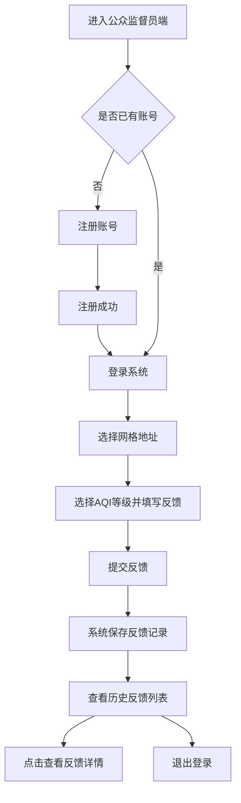
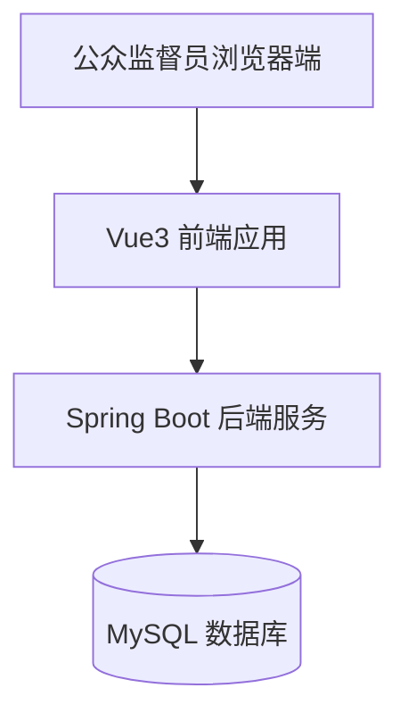

# 公众监督员端项目说明书

## 1. 项目概述

## 2. 建设背景与需求分析

### 2.1 业务需求

公众监督员端需要满足以下基本业务需求：

- 新用户能够完成注册。
- 已注册用户能够通过手机号和密码登录系统。
- 用户能够选择反馈所属的省、市和详细地址。
- 用户能够根据当前感受选择 AQI 预估等级并填写文字描述。
- 用户能够提交反馈信息到后台数据库。
- 用户能够查看本人提交过的历史反馈记录。
- 用户能够查看某条反馈的详细信息。
- 用户能够安全退出当前登录状态。

### 2.2 非功能需求

除了核心功能外，系统还需要满足以下非功能需求：

- 页面操作简单，适合移动端风格展示。
- 表单输入必须有基础校验，减少非法数据提交。
- 操作结果需通过弹窗及时反馈给用户。
- 前后端分离，便于后续角色扩展与联调。
- 代码结构清晰，便于维护和讲解。

---

## 3. 公众监督员端业务说明

### 3.1 角色定义

公众监督员是空气质量监督链路中的信息提供者，主要负责发现空气质量异常现象并向系统反馈。

### 3.2 角色职责

公众监督员端负责完成以下业务：

- 注册个人账号。
- 登录系统。
- 选择反馈发生的网格地址。
- 提交空气质量反馈信息。
- 查看历史反馈。
- 查看反馈详情。
- 退出登录。

### 3.3 业务边界

公众监督员端仅负责“提交与查询”，不负责“分派与处理”。因此，公众监督员端不会修改以下管理流程相关字段：

- `gm_id`
- `assign_date`
- `assign_time`
- 反馈状态从“已指派”到“已确认”的流转逻辑

对于新提交的反馈，系统默认初始化为：

- `gm_id = 0`
- `state = 0`
- `assign_date = null`
- `assign_time = null`

这表示该反馈尚未被管理员指派给网格员。

### 3.4 业务闭环说明

公众监督员端的业务闭环如下：

1. 用户注册账号。
2. 用户登录系统。
3. 用户选择网格地址。
4. 用户提交 AQI 反馈。
5. 系统保存反馈信息。
6. 用户可查看历史反馈与详情。
7. 后续管理员和网格员再基于该反馈执行分派和核查。

---

## 4. 功能模块设计

### 4.1 注册模块

功能说明：

- 面向未注册用户，完成公众监督员账号创建。

输入项：

- 手机号码
- 真实姓名
- 年龄
- 性别
- 密码
- 确认密码

校验规则：

- 手机号必须为 11 位且以 `1` 开头。
- 真实姓名至少 2 个字。
- 年龄范围为 `1~120`。
- 密码长度不少于 3 位。
- 两次密码必须一致。

输出结果：

- 注册成功后跳转登录页。
- 若手机号已存在，则提示用户重新输入。

### 4.2 登录模块

功能说明：

- 面向已注册用户，完成身份校验并进入业务页面。

输入项：

- 手机号
- 密码

校验规则：

- 手机号格式正确。
- 密码不能为空且不少于 3 位。

输出结果：

- 登录成功后进入网格地址选择页。
- 登录失败时弹窗提示错误原因。

### 4.3 网格地址选择模块

功能说明：

- 让用户选择反馈所属区域，为后续反馈提交提供位置基础。

输入项：

- 省份
- 城市
- 详细地址

校验规则：

- 必须选择完整省市。
- 详细地址不能为空。

输出结果：

- 地址信息暂存后进入 AQI 反馈页。

### 4.4 AQI 反馈提交模块

功能说明：

- 用户根据主观感受选择 AQI 预估等级并提交反馈说明。

输入项：

- AQI 预估等级
- 反馈描述

校验规则：

- AQI 等级必选。
- 反馈描述不能为空。

输出结果：

- 提交成功后进入历史反馈页。

### 4.5 历史反馈查询模块

功能说明：

- 查询当前登录公众监督员提交过的所有反馈信息。

展示内容：

- 提交时间
- 省市信息
- 反馈地址
- AQI 预估等级
- 反馈状态概览

### 4.6 反馈详情弹窗模块

功能说明：

- 用户点击历史记录后，通过弹窗查看反馈完整内容。

展示内容：

- 手机号
- 省份
- 城市
- 详细地址
- AQI 预估等级
- 反馈描述
- 反馈时间
- 状态信息

说明：

- 当前实现中，如果状态为“未指派”，前端不显示状态这一行，以符合展示要求。

### 4.7 退出登录模块

功能说明：

- 清理当前登录信息并返回登录页。

输出结果：

- 删除会话中的监督员信息。
- 返回登录页面。

---

## 5. 业务流程图

### 5.1 公众监督员主业务流程图



### 5.2 反馈数据流转图


### 5.3 业务说明

从业务上看，公众监督员端是整个系统的起点。该端负责采集主观观察到的空气质量异常信息，后续管理员和网格员将在此基础上继续推进分派与核查流程。

---

## 6. 技术方案与系统架构

### 6.1 前端技术栈

- `Vue 3`
- `Vue Router 4`
- `Axios`
- `Vite`
- `Font Awesome`

### 6.2 后端技术栈

- `JDK 17`
- `Spring Boot 3.3.0`
- `MyBatis-Plus 3.5.7`
- `Maven`
- `MySQL 8`

### 6.3 架构模式

本项目采用前后端分离架构：

- 前端负责页面渲染、表单校验、路由跳转和用户交互。
- 后端负责业务处理、参数校验、数据库访问和统一响应。
- 数据库负责存储监督员信息、反馈记录和省市基础数据。

### 6.4 系统架构图



### 6.5 当前实现特点

- 前后端职责划分明确。
- 采用统一响应结构 `ApiResponse`。
- 后端使用参数校验和全局异常处理保证接口稳定性。
- 前端使用弹窗组件统一反馈操作结果。

---

## 7. 数据库与核心数据设计

### 7.1 监督员表 `supervisor`

作用：

- 存储公众监督员账户基本信息。

关键字段：

- `tel_id`：手机号，主键
- `password`：登录密码
- `real_name`：真实姓名
- `birthday`：出生日期
- `sex`：性别
- `remarks`：备注

说明：

- 前端页面采集的是“年龄”，后端通过工具类换算出 `birthday` 后入库。

### 7.2 反馈表 `aqi_feedback`

作用：

- 存储公众监督员提交的 AQI 反馈信息。

关键字段：

- `af_id`：反馈编号
- `tel_id`：监督员手机号
- `province_id`：省份编号
- `city_id`：城市编号
- `address`：详细地址
- `information`：反馈描述
- `estimated_grade`：AQI 预估等级
- `af_date`：反馈日期
- `af_time`：反馈时间
- `gm_id`：指派网格员编号
- `assign_date`：指派日期
- `assign_time`：指派时间
- `state`：状态，`0` 未指派，`1` 已指派，`2` 已确认
- `remarks`：备注

说明：

- 公众监督员端创建反馈时，只负责写入地址、内容、等级和提交时间等信息。
- 指派相关字段不由公众监督员端修改。

### 7.3 省份表 `grid_province`

作用：

- 存储省级区域基础数据，为地址选择提供数据来源。

### 7.4 城市表 `grid_city`

作用：

- 存储城市基础数据，并通过 `province_id` 与省份形成关联。

### 7.5 核心数据映射关系

前端字段与数据库字段关系示例如下：

| 前端字段 | 后端请求字段 | 数据库字段 |
| --- | --- | --- |
| 手机号 | `phone` / `telId` | `tel_id` |
| 真实姓名 | `realName` | `real_name` |
| 年龄 | `age` | 通过后端转换为 `birthday` |
| 性别 | `sex` | `sex` |
| 省份 | `provinceId` | `province_id` |
| 城市 | `cityId` | `city_id` |
| 详细地址 | `address` | `address` |
| 反馈描述 | `information` | `information` |
| AQI 等级 | `estimatedGrade` | `estimated_grade` |

---

## 8. 接口设计与实现说明

### 8.1 响应结构

后端统一采用如下结构返回数据：

```json
{
  "code": 200,
  "message": "操作成功",
  "data": {}
}
```

其中：

- `code`：业务状态码
- `message`：提示信息
- `data`：业务数据

### 8.2 监督员相关接口

#### 8.2.1 检查手机号是否已注册

- 请求方式：`GET`
- 接口地址：`/api/supervisor/checkPhone`
- 参数：`phone`
- 功能说明：在注册前检查手机号是否已存在

#### 8.2.2 注册监督员

- 请求方式：`POST`
- 接口地址：`/api/supervisor/register`
- 功能说明：保存新的公众监督员信息

请求示例：

```json
{
  "phone": "19900000001",
  "password": "123",
  "realName": "测试用户",
  "age": 22,
  "sex": 1
}
```

#### 8.2.3 登录监督员

- 请求方式：`POST`
- 接口地址：`/api/supervisor/login`
- 功能说明：手机号和密码校验

请求示例：

```json
{
  "phone": "15544523687",
  "password": "123"
}
```

### 8.3 反馈相关接口

#### 8.3.1 保存 AQI 反馈

- 请求方式：`POST`
- 接口地址：`/api/aqiFeedback/save`
- 功能说明：保存公众监督员提交的 AQI 反馈信息

请求示例：

```json
{
  "telId": "15544523687",
  "provinceId": 1,
  "cityId": 1,
  "address": "朝阳区建国路100号",
  "information": "空气中有明显异味，能见度一般",
  "estimatedGrade": 3
}
```

#### 8.3.2 按手机号查询历史反馈

- 请求方式：`GET`
- 接口地址：`/api/aqiFeedback/listByTel`
- 参数：`telId`
- 功能说明：查询当前公众监督员的历史反馈列表

#### 8.3.3 按反馈编号查询详情

- 请求方式：`GET`
- 接口地址：`/api/aqiFeedback/{id}`
- 功能说明：查询某条反馈的详细信息

### 8.4 地区相关接口

#### 8.4.1 查询省份列表

- 请求方式：`GET`
- 接口地址：`/api/region/provinces`
- 功能说明：查询所有省份信息

#### 8.4.2 按省份查询城市

- 请求方式：`GET`
- 接口地址：`/api/region/cities`
- 参数：`provinceId`
- 功能说明：根据省份编号查询城市列表

### 8.5 关于新增接口的说明

原始接口文档中没有提供“省份列表”和“城市列表”查询接口。如果前端要实现“省市联动选择”且数据来源于后端，就需要补充地区查询接口。当前实现采用新增地区接口的方式，以保证地区数据统一、可维护、可复用。

如果后续项目要求严格保持原接口数量不变，也可以改为在前端本地维护静态省市数据，但那样会降低数据统一性和后续复用性。

---

## 9. 前端页面与交互说明

### 9.1 登录页

页面作用：

- 让已注册监督员完成登录。

主要交互：

- 输入手机号和密码。
- 点击“注册”跳转到注册页。
- 点击“登录”校验通过后进入地址选择页。

### 9.2 注册页

页面作用：

- 让新用户创建公众监督员账号。

主要交互：

- 输入手机号、真实姓名、年龄、性别、密码和确认密码。
- 前端先执行基础校验，再调用后端接口。
- 注册成功后跳转回登录页。

### 9.3 选择网格地址页

页面作用：

- 收集当前反馈所属区域。

主要交互：

- 选择省份。
- 根据省份加载城市。
- 填写详细地址。
- 点击“下一步”进入 AQI 反馈页。

### 9.4 AQI 反馈页

页面作用：

- 提交 AQI 预估等级与反馈描述。

主要交互：

- 选择 1~6 级 AQI 等级。
- 填写文字描述。
- 点击“提交”后保存至后台。

### 9.5 历史反馈页

页面作用：

- 查看当前监督员已提交的反馈列表。

主要交互：

- 列出历史反馈。
- 点击某条记录弹出详情弹窗。
- 右上角可执行退出登录操作。

### 9.6 弹窗交互说明

当前前端使用统一弹窗组件展示以下结果：

- 校验失败提示
- 注册成功或失败提示
- 登录成功或失败提示
- 提交成功或失败提示
- 历史查询失败提示
- 退出提示

---

## 10. 代码结构说明

### 10.1 后端代码结构

后端目录：`e:\zll\supervisor\backend`

主要结构如下：

- `common`
  - 存放通用返回对象 `ApiResponse`
- `config`
  - 存放跨域配置和全局异常处理
- `controller`
  - 存放接口控制器，对外暴露 REST API
- `dto`
  - 存放请求与响应数据传输对象
- `entity`
  - 存放数据库实体类
- `mapper`
  - 存放 MyBatis-Plus 数据访问层
- `service`
  - 存放服务接口
- `service/impl`
  - 存放服务实现类
- `util`
  - 存放工具类，如年龄与生日转换工具

### 10.2 前端代码结构

前端目录：`e:\zll\supervisor\front\supervisor`

主要结构如下：

- `src/api`
  - 封装所有后端接口调用
- `src/assets`
  - 存放页面图片资源
- `src/components`
  - 存放通用组件，如消息弹窗组件
- `src/router`
  - 配置前端路由
- `src/utils`
  - 存放表单校验逻辑等工具方法
- `src/views`
  - 存放各页面视图组件
- `src/common.js`
  - 封装会话存储操作

### 10.3 主要页面文件

- `SupervisorLogin.vue`
- `SupervisorRegister.vue`
- `SupervisorGridSelect.vue`
- `SupervisorAqiFeedback.vue`
- `SupervisorHistory.vue`

---

## 11. 关键实现说明

### 11.1 前端表单校验

前端在提交请求前对表单进行基础校验，主要包括：

- 手机号格式校验
- 年龄范围校验
- 密码一致性校验
- 地址非空校验
- 反馈描述非空校验

这样可以减少无效请求，提升交互体验。

### 11.2 会话信息保存

登录成功后，前端通过 `sessionStorage` 保存监督员信息，用于后续页面获取当前登录用户身份。

### 11.3 省市联动实现

地址选择页先调用省份接口，再根据所选省份查询城市列表，实现下拉联动。

### 11.4 AQI 等级展示方式

当前前端将 AQI 等级说明以内置常量形式展示，用于保证反馈页面可以稳定渲染等级信息，不依赖额外查询接口。

### 11.5 年龄到生日的转换

由于数据库中保存的是 `birthday`，而前端输入的是 `age`，后端使用 `AgeUtil` 将年龄换算为生日后再存入数据库。

### 11.6 全局异常处理

后端通过全局异常处理类统一拦截：

- 参数校验异常
- 请求体格式错误
- 非法参数异常
- 其它运行时异常

从而保证前端能收到结构统一的错误响应。

### 11.7 反馈状态展示处理

反馈详情中，如果某条记录状态为“未指派”，前端不显示该状态行，以满足页面展示要求；如果后续状态变为“已指派”或“已确认”，则正常展示。

---

## 12. 项目运行说明

### 12.1 环境要求

- `JDK 17`
- `Maven 3.8+`
- `Node.js 18+`
- `MySQL 8`

### 12.2 数据库准备

1. 创建数据库 `nep`
2. 导入业务表 SQL
3. 导入省市基础数据表 SQL
4. 确认数据库账号密码与后端配置一致

### 12.3 后端配置

配置文件位置：

- `e:\zll\supervisor\backend\src\main\resources\application.yml`

当前默认配置：

- 端口：`8080`
- 数据库地址：`jdbc:mysql://localhost:3306/nep`
- 用户名：`root`
- 密码：`123456`

### 12.4 启动后端

在后端目录执行：

```bash
mvn spring-boot:run
```

### 12.5 启动前端

在前端目录执行：

```bash
npm install
npm run dev
```

### 12.6 访问地址

- 前端地址：`http://localhost:8084/`
- 后端地址：`http://localhost:8080/`

### 12.7 运行说明

- 前端通过 `/api` 代理访问后端。
- 启动顺序建议先后端、再前端。
- 若数据库未启动，注册、登录、反馈提交等接口将无法正常工作。

---

## 13. 功能测试说明

### 13.1 测试目标

验证公众监督员端的主业务闭环和常见异常场景是否符合预期。

### 13.2 测试范围

- 注册
- 登录
- 地址选择
- AQI 反馈提交
- 历史查询
- 详情弹窗
- 退出登录

### 13.3 典型测试用例

#### 用例一：注册时手机号格式错误

- 输入：手机号 `123`
- 预期结果：前端提示“请输入正确的 11 位手机号”
- 实际结果：校验拦截成功

#### 用例二：重复注册

- 输入：已存在手机号
- 预期结果：提示“手机号已注册”
- 实际结果：后端返回 `409`

#### 用例三：错误密码登录

- 输入：正确手机号 + 错误密码
- 预期结果：提示登录失败
- 实际结果：后端返回 `401`

#### 用例四：地址未填写

- 输入：未选省市或未填详细地址
- 预期结果：禁止进入下一步
- 实际结果：前端校验拦截成功

#### 用例五：未选择 AQI 等级提交

- 输入：未选 AQI 等级
- 预期结果：提示必须选择等级
- 实际结果：前端校验拦截成功

#### 用例六：正常提交反馈

- 输入：完整地址、AQI 等级、反馈内容
- 预期结果：保存成功并进入历史列表
- 实际结果：接口保存成功，数据库生成记录

#### 用例七：历史记录查看

- 输入：查询当前登录用户手机号
- 预期结果：返回本人历史记录
- 实际结果：查询成功，可弹出详情

### 13.4 测试方式

本项目当前以以下方式进行验证：

- 人工页面操作测试
- 前后端联调测试
- 部分前端校验逻辑的基础测试

### 13.5 测试结论

公众监督员端的主业务闭环已经打通，能够完成从注册、登录、地址选择、反馈提交到历史查看的完整流程。


